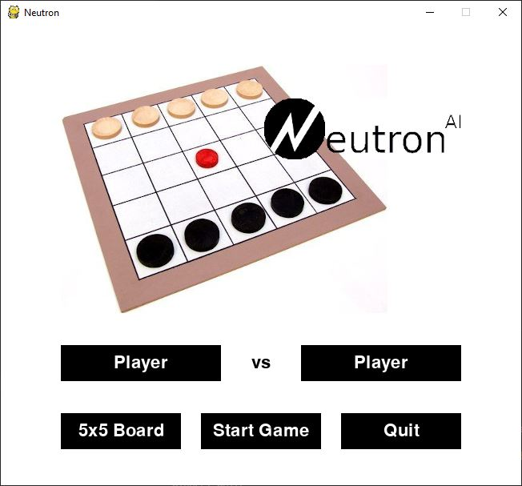
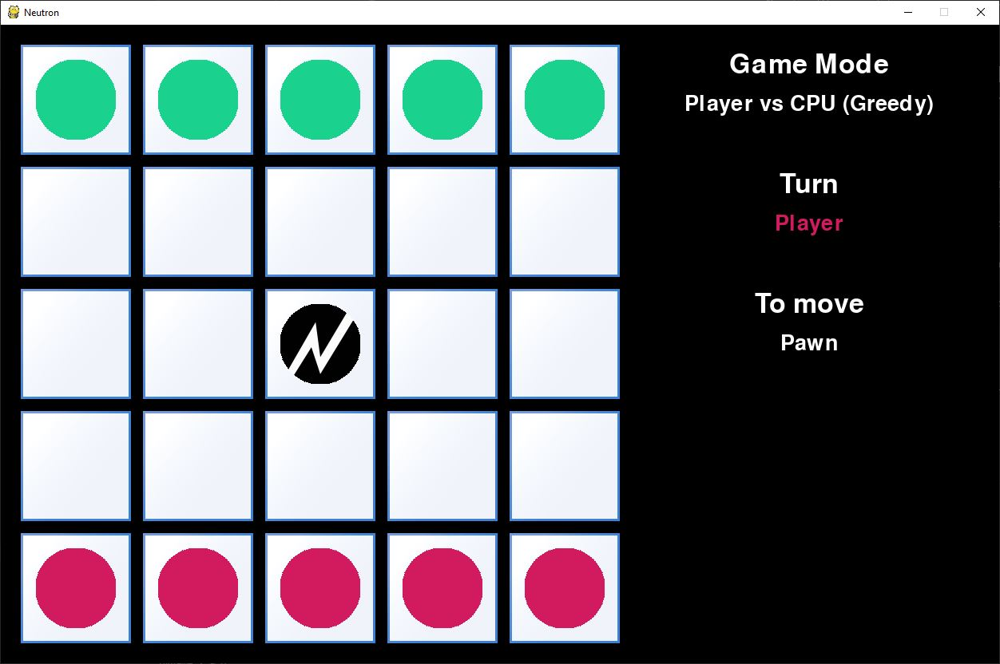

# IART Project #1 - Neutron board game in Python (using Minimax algorithm)

## How to Run
To be able to run the game, you need the *pygame* package:

```
pip install pygame
```

Once *pygame* is installed, just execute the [main.py file](main.py):

```python
python main.py
```

## How to Play

On the main menu, you can select the players and the size of the board. 



During the game (if there is a human player) you can control the pieces, during your turn, by clicking and holding on the piece you want to move and sliding it in the desired direction.



## Bots

The bot moves are calculated using minimax with alpha-beta pruning, with differing depths and heuristics in each different level:
* Greedy:
    * Heuristic #1
    * Depth: 1
    * Minimax Variation with α–β pruning

* Level 0:
    * Heuristic #1
    * Depth: 2
    * Minimax Variation with α–β pruning

* Level 1:
    * Heuristic #1
    * Depth: 3
    * Minimax Variation with α–β pruning

* Level 2:
    * Heuristic #2
    * Depth: 3
    * Minimax Variation with α–β pruning

* Level 3:
    * Heuristic #3
    * Depth: 3
    * Minimax Variation with α–β pruning

* Random Minimax:
    * Heuristic #3
    * Depth: 3
    * Minimax Variation with α–β pruning that chooses one of best moves randomly

* Ordered Minimax:
    * Heuristic #3
    * Depth: 3
    * Minimax Variation with α–β pruning that checks the most likely to be better Neutron directions first

**Note**: the levels indicate different search parameters, they do not imply better skill or efficiency.

### Heuristics

#### Heuristic #1

*NeutronNumPathsToPlayer* - *NeutronNumPathsToOpponent*

#### Heuristic #2

10 * *NumEmptyTilesPlayer* - 10 * *NumEmptyTilesOpponent* + 10 * *Odd* * (8 - *NumEmptyTilesAroundNeutron*)

#### Heuristic #3

10 * *NumEmptyTilesPlayer* - 10 * *NumEmptyTilesOpponent* + 200 * *NeutronNumPathsToPlayer* - 200 * *NeutronNumPathsToOpponent* + 10 * *Odd* * (8 - *NumEmptyTilesAroundNeutron*)

#### In all heuristics
*VictoryPlayer* -> 999 - *depth*
*VictoryOpponent* -> -999 + *depth*

* *NumEmptyTilesPlayer* - Number of empty tiles in the current player's base
* *NumEmptyTilesOpponent* - Number of empty tiles in the opponent's base
* *NeutronNumPathsToPlayer* - Number of paths the Neutron can take directly to the current player's base
* *NeutronNumPathsToOpponent* - Number of paths the Neutron can take directly to the opponents's base
* *NumEmptyTilesAroundNeutron* - Number of empty tiles around Neutron
* *Odd* - **1** *if* *NumEmptyTilesAroundNeutron* is odd *else* **-1**
* *VictoryPlayer* - *if* Neutron is in current player's base
* *VictoryOpponent* - *if* Neutron is in opponent's base
* *depth* - minimax tree depth
